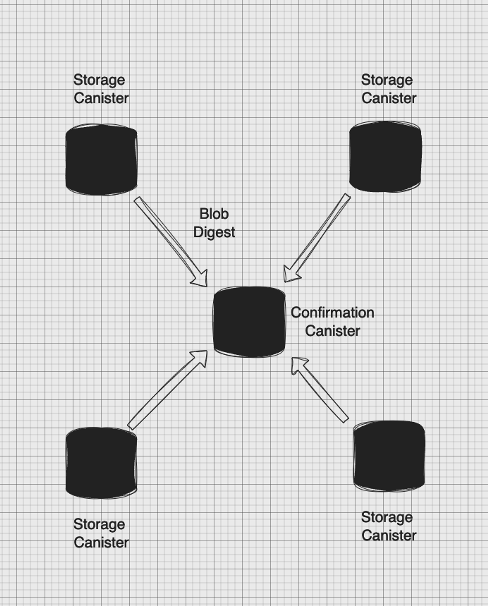

# ICDA Storage Canister and Signature Canister

## Storage Canister

K-V storage and retrieval canister for the blob.

### Canister Types

```rust
///Storage Canister
// Canister Get Blob Types
struct Blob {
    data: Vec<u8>, // blob data
    next: Option<usize>, // next slice index : u64
}

/// Save Blob Argument
/// Considering the storage pressure acceptance capability of the subnet,  
/// currently using serial upload for each Blob slice
struct BlobChunk {
    /// Segmented upload index.
    index: usize,

    /// Sha256 digest of the blob in hex format.
    digest: [u8; 32],

    /// Time since epoch in nanoseconds.
    timestamp: u128,

    /// Total blob size in bytes.
    total: usize,

    /// Blob slice, a piece of the Blob
    data: Vec<u8>,
}


// Storage Canister Configuration
struct Config {
    // The principal who can upload to the storage canister
    signature_canister: Principal,
    // The designated canister for issuing confirmations 
    // and signatures (the signature canister 
    // is also known as the confirmation canister)
    owner: Principal,
    // Can be adjusted to accommodate the actual 
    // storage requirements for faster blob retrieval	  
    query_response_size: usize,
    // The number of blobs the storage canister will keep
    // currently, it is set to the number of blobs stored over 7 days
    canister_storage_threshold: u32,
}

enum Result {
    Ok(),
    Err(String)
}
```

### Canister Services

```rust
// Get the first slice of the Blob (if slicing is needed, return)
fn get_blob(digest: [u8; 32]) -> Blob {}

// If slicing is needed, use this interface to get the second slice and later slices
fn get_blob_with_index(digest: [u8; 32], index: usize) -> Blob {}

/// Sliced save blob
fn save_blob(chunk: BlobChunk) -> Result<(), String> {}
```

## Signature Canister

Architecture:

- Signature Canister is responsible for creating threshold signature and maintaining the Confirmation.



Details:

- Currently, every 12 (adjustable) Digests form a BatchConfirmation, which will constitute an independent, immutable
  Merkle Tree.
  When a Batch's Merkle Tree has 12 Digest Nodes(adjustable), it triggers the operation of Signing the Merkle Root.
  After the Canister completes the Signature, it will save this BatchConfirmation.
- Each BatchConfirmation will remain active for a period of one week (adjustable).

### Canister Types

```rust

enum ConfirmationStatus {
    // In the confirmation canister, but not yet signed
    Pending,

    // The confirmation has been signed
    // returning the confirmation for the requested digest
    Confirmed(Confirmation),

    // The requested digest is not in the confirmation canister
    // retired or invalid
    Invalid,
}

struct Confirmation {
    pub root: [u8; 32], // Merkle root hash
    pub proof: Proof, // Merkle proof
    pub signature: String, // Hex-encoded signature
}

struct Proof {
    pub proof_bytes: Vec<u8>, // Merkle proof of the requested digest
    pub leaf_index: usize, // The index of the requested digest in the Merkle tree
    pub leaf_digest: [u8; 32], // The requested digest
}

struct BatchConfirmation {
    // If the canister has signed, it's Some(signature), otherwise None
    pub signature: Option<String>,

    // Merkle root （Merkle Tree: 12 Digest Nodes）
    pub root: [u8; 32],

    // A vector composed of blob digests, 
    // which are the nodes of the batch confirmation's Merkle tree
    // Under normal circumstances, it is 12
    pub nodes: Vec<[u8; 32]>,
}

// confirmation canister config
struct Config {
    pub confirmation_batch_size: usize, // Currently, a set of how many digests forms one confirmation.
    pub confirmation_live_time: u32, // Currently, confirmations are stored for one week
    pub da_canisters: HashSet<Principal>, // refers to "data availability canisters," which is the term for storage canisters.
    pub owner: Principal, // the principal who is authorized to update the configuration.
}

```

### Canister Services

```rust
/// Confirmation Canister Interfaces
// get confirmation 
fn get_confirmation(digest: [u8; 32]) -> ConfirmationStatus {}

// get canister public key
fn public_key() -> Vec<u8> {}

// only storage canister can call this interface
// insert a new blob digest to confirmation canister
fn insert_digest(digest: [u8; 32]) {}

// update signature canister config
fn update_config(config: Config) {}

```